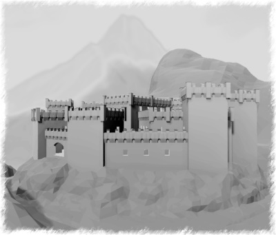

# godot_castle
Godot Community Projekt

## Einleitung
Bei diesem Vorhaben geht es darum zu zeigen was
mit Godot möglich ist.

Es sollen unterschiedliche Techniken vorgestellt und an einem Beispiel
beschrieben werden. Die Idee welche hinter diesem Projekt steckt, ist in Form
von einer Gemeinschaftsarbeit, gängige Methoden aus den unterschiedlichen
Bereichen aufzuzeigen. Angefangen von der Modellierung, Texturierung bis hin
zur Programmierung.

Besonders den optimalen Workflow wollen wir ausarbeiten und dokumentieren.

Für jedes Thema wird es eigene Räume geben. Es werden beispielsweise Shader
vorgestellt und Materialien gezeigt. In der Bibliothek werden Bücher über
jegliche Informationen im weitesten Sinne über Godot zu finden sein.
Inwieweit wir hier das bestehende Wiki mit einfließen lassen, ist noch nicht geklärt.

Da es sich um ein lang angelegtes Projekt handelt, vielleicht wird es nie fertig,
besteht auch kein Zeitdruck.

Wir laden Dich herzlich ein, an diesem Projekt mitzuwirken.

## Mitmachen
Wie könnt ihr euch am Projekt beteiligen?

Zuerst einmal wenn ihr Ideen und Vorschäge einbringt, was ihr gerne in der Burg sehen möchtet, was ausgestellt werden soll.  
Das sollte wenn möglich, mit dem Thema Godot-Engine zu tun haben.

Eine weitere möglichkeit besteht darin, wenn ihr ein wenig kreativ seid, das ihr Modelle, Skripte, Materialien, Texturen usw... beisteuert.

Noch besser ist, wenn ihr selber ganze Räume ausstatten möchtet.
Eine genau Beschreibung wie ihr das machen könnt, folgt noch.

Weitere Informationen im [Wiki](https://github.com/Maurehago/godot_castle/wiki/Kundmachung "Wiki Startseite")
